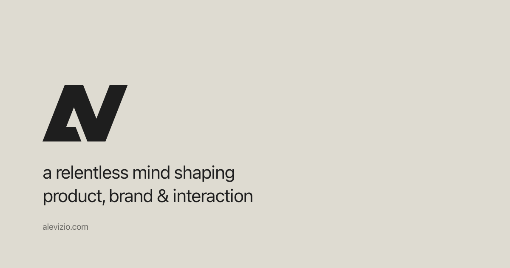

# alevizio.com

Personal portfolio site for Alejandro Vizio, built as a minimal single-page experience focused on product, brand, and interaction design.



## Live site

- Production: [alevizio.com](https://alevizio.com)
- Repository: [github.com/alevizio/alevizio.com](https://github.com/alevizio/alevizio.com)

## What is in this repo

- A custom animated landing page built with React, Vite, Tailwind CSS, and Motion
- An interactive ASCII rain background with pointer-responsive ripples
- A copy-to-clipboard contact CTA and social profile links
- Company logo highlights, SEO metadata, Open Graph tags, `llms.txt`, sitemap, and robots configuration
- The actual source for the live portfolio, not just a static export

## Stack

- React 18
- Vite 6
- Tailwind CSS 4
- Motion
- Vercel Analytics
- Vercel Speed Insights

## Local development

```bash
npm install
npm run dev
```

Build a production bundle with:

```bash
npm run build
npm run preview
```

## Project notes

- The project started from a Figma Make export and was then refined directly in code.
- Production is served from `https://alevizio.com` on Vercel.
- The repository is prepared to be public for reference and transparency around the implementation.

## License and usage

This repository is source-available, but it is not open source.

- The site design, written copy, branding, and custom assets remain protected.
- Reuse, redistribution, or derivative work requires prior written permission unless a third-party license says otherwise.
- See [LICENSE](./LICENSE) and [ATTRIBUTIONS.md](./ATTRIBUTIONS.md) for details.
  
